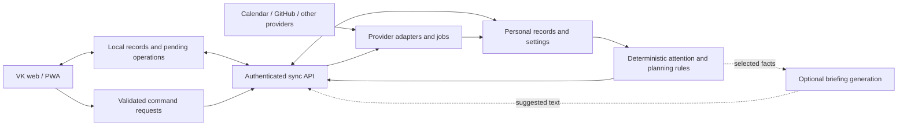

# VK as a personal home control point

Research date: 26 September 2026. Scope confirmed by the user: personal command centre for work, projects, life, and connected apps.

## Recommendation

Develop VK into the place where you understand your day, resolve important changes, and resume work with its context intact. The most valuable upgrade is a connected loop: **capture → clarify → plan → act → review**.

Keep the white, restrained visual identity and the particle orb. Give the orb a clear job as an entry to briefing, search, and commands. Give commitments, decisions, and useful actions the most prominent space.

The proposed direction combines launcher speed, realistic daily planning, an attention inbox, and dependable service integrations. This is a synthesis of the sources below and the inspected application, not a claim that one researched product already provides the exact proposed system.

## What was inspected

Read the current React/Vite application, styles, orb, command wheel, persistence helper, Supabase connection check, manifest, and service worker. Opened a separate browser session on a local development server. Inspected desktop at 1440 × 900 and mobile at 390 × 844, including rendered sizes and positions. Created a temporary PIN only within that isolated browser profile.

Evidence: [desktop capture](./vk-research-desktop.png) and [mobile capture](./vk-research-mobile.png).

This was a product and architecture investigation. No connected account data was queried, no production sync was tested, and no application code was changed. The automated accessibility command returned zero passes as well as zero violations, so it provides no meaningful accessibility assurance. Browser measurements and source inspection support the specific observations below; a complete accessibility assessment remains future work.

## Current gaps that directly limit usefulness

| Finding | Evidence in this checkout | Consequence | Recommended change |
| --- | --- | --- | --- |
| Date labels disagree with urgency | Seed tasks due today render as “Tomorrow.” `formatDue` uses a ceiling of the difference to 23:59:59. | The interface can say urgent today while telling you tomorrow. | Compare calendar dates in a consistent user timezone; distinguish deadlines from scheduled work. |
| Calendar is illustrative | `ExpandedWidget` renders a fixed “24 September” and the meeting “Architecture review”; the home screen always shows 10:30. | It cannot be trusted as the next commitment. | Remove unlabelled samples from normal operation; ingest actual events and choose the next non-cancelled event. |
| Connection is presented as sync | The Supabase helper requests `/auth/v1/settings`; task/project persistence uses localStorage. | “SUPABASE CONNECTED” does not establish saved cloud records or cross-device recovery. | Separate service reachability, signed-in identity, successful data sync, and pending changes. |
| Suggested tasks are not actually ranked | The compact list and attention queue use array order; the expanded task screen claims urgency ordering but maps the original array. | Important new work can be hidden below older entries. | One shared selector should rank items across the home screen, briefing, and task views. |
| Viewing and completing are conflated | Clicking an entire task or a briefing queue item toggles completion. | Trying to inspect a task can accidentally complete it. | Row opens detail; checkbox completes; provide undo and explicit row actions. |
| Progress is manually inflated | Project buttons add five percentage points; the briefing averages these values. | Attractive metrics carry little decision value. | Use milestones and next actions; label manual progress as manual and avoid a portfolio-wide mean. |
| Controls imply unavailable functions | Notification bell has no handler; “Connect source” has no handler; market setup is a display label. | The control centre reaches dead ends. | Each control needs a working action, an explained unavailable state, or removal. |
| Mobile attention is delayed | At 390 × 844, projects start at y=419, the task widget at y=690, and the first task title at y=770. | The orb and portfolio occupy most of the first screen before urgent work. | Put next action and commitment first; shrink the orb and move portfolio detail below them. |
| Mobile controls need refinement | Capture measures 34 × 32 CSS px and wraps below the main header; expand buttons measure 32 × 32. | Common actions are less comfortable to reach and tap. | Use a stable mobile header and at least 44 × 44 CSS px hit areas for primary touch actions. |
| Personal records lack a recovery model | localStorage writes have no failure handling, export, versioned records, or synchronization protocol. | Browser storage becomes the sole copy without clear recovery. | Migrate records to a transactional local store, add export/restore, and implement explicit synchronization. |
| PIN is a screen lock | PIN hash is in localStorage and unlock state is in sessionStorage; the gate only controls rendering. | It cannot authorize access to future cloud integrations. | Use real account authentication and server-side access control; retain PIN only as a convenience privacy lock. |
| Free placement has no layout rules | Percentage positions are persisted while widgets can overlap and fixed-height bodies hide overflow. | Adding modules makes the canvas increasingly fragile. | Default to responsive grid slots; enable rearrangement in an explicit edit mode. |

Source locations: `src/main.jsx` (date helpers, persistence, ranking, interactions, PIN, sample schedule), `src/lib/supabase.js` (reachability check), `src/styles.css` (layout and hit areas), `public/sw.js` (offline caching).

## What the online research contributes

The product documentation establishes capabilities and patterns. It does not prove a particular productivity gain, so the proposed benefits should be tested against your actual daily use.

| Reference | Verified pattern | Application to VK | Limit of the comparison |
| --- | --- | --- | --- |
| [Raycast Search Bar](https://manual.raycast.com/search-bar), [Quicklinks](https://manual.raycast.com/quicklinks) | Search across resources, contextual actions, searchable shortcuts, aliases and favourites. | One place to find a project, open its tools, and perform a command. | Raycast has native desktop privileges that this web app does not. |
| [Akiflow Command Bar](https://product.akiflow.com/articles/6483573-command-bar) | Fast capture, task/event creation, natural-language dates, and source reopening. | A command input with previewable parsing and source-linked capture. | Global shortcuts are a desktop capability; in-browser shortcuts require app focus. |
| [Sunsama Daily Planning](https://help.sunsama.com/docs/usage-guides/daily-planning/) | Planned durations, workload review, deferral, and calendar timeboxing. | Show whether the proposed day fits before presenting a confident plan. | Estimates are necessary; unknown durations should remain explicitly unknown. |
| [Linear Inbox](https://linear.app/docs/inbox), [Pulse](https://linear.app/docs/pulse) | Priority notifications, snoozing, issue actions, and scheduled project summaries. | Separate actionable exceptions from ordinary updates and capture. | Team notification conventions need simplifying for a personal product. |
| [Homepage services](https://gethomepage.dev/configs/services/), [API guide](https://gethomepage.dev/widgets/authoring/api/) | Service links with data widgets; API access through a proxy. | Pair status with a launch action and isolate provider access from presentation. | A service dashboard alone does not model your commitments or daily plan. |
| [Homarr onboarding](https://homarr.dev/docs/getting-started/after-the-installation/) | Boards, apps, integrations, connection testing, and explicit edit mode. | Build understandable connection setup and stable customization. | Server management is a different primary job from personal planning. |
| [Glance README](https://github.com/glanceapp/glance/blob/main/README.md), [configuration](https://github.com/glanceapp/glance/blob/main/docs/configuration.md) | Compact feed widgets, configurable caches, monitors, and custom API views. | Keep interests and ambient information compact and refresh-aware. | Its README says most data updates on page load, rather than periodic background refresh; that model is insufficient for urgent commitments. |
| [Obsidian Bases](https://obsidian.md/help/bases), [URI](https://help.obsidian.md/Extending%2BObsidian/Obsidian%2BURI) | Structured views over local notes and links that open or create notes. | Attach notes, decisions, and references to a project without rebuilding a full editor. | Vault access and native file opening need explicit platform support. |

The design recommendation draws on Apple's principles, translated to a web app rather than treating native Apple conventions as web requirements. The loaded HIG references include `accessibility.md › Vision / Mobility`, `layout.md › Best practices`, `feedback.md`, `motion.md › Best practices`, and `generative-ai.md › Best practices / Outputs`. For web controls, [WCAG target size minimum](https://www.w3.org/WAI/WCAG22/Understanding/target-size-minimum) specifies 24 × 24 CSS px with exceptions; [target size enhanced](https://www.w3.org/WAI/WCAG22/Understanding/target-size-enhanced) specifies 44 × 44. The larger size is my recommended touch design target, not a claim that every current 32 px button automatically fails AA.

## The product to build

### 1. A home screen organized around decisions

The first screen should answer:

1. What needs my attention now?
2. What have I committed to next?
3. What can I realistically work on before that?
4. Where do I open the relevant context?

Recommended desktop composition:

```text
VK   Home / Work / Life     Search or command…      Capture   Connections

Needs attention                 Today                  Resume
3 actionable exceptions         Next commitment       Current project
Reason and source per item       Free focus window     Last checkpoint
Open / resolve / snooze          Selected next action  Repository / app / notes

                    Compact VK orb + current briefing

Projects: next milestone         Life admin            Optional interests
Blocked / moving / waiting       Upcoming obligations  Weather / markets / feeds
```

Recommended mobile sequence: compact greeting and orb → next commitment → top attention items → chosen focus task → resume links → remaining modules. Use Home, Inbox, Plan, and Projects as a starting navigation structure, with Capture available from every screen. Test the structure rather than assuming four tabs are optimal.

Keep a stable order while someone is reading. An update can badge a module without moving it under their finger. Contextual modes can hide or collapse optional sections, but essential navigation remains predictable.

### 2. An attention queue with explainable ranking

Replace the single opaque severity score with individual items that explain themselves: “Deadline today; estimated 90 minutes; no planned block,” “Deployment failed; production unchanged,” or “Meeting in 20 minutes; join link available.” These are proposed examples, not observed live conditions.

Each item needs a reason, source, timestamp, related project, and an appropriate next action. Allow snooze, dismissal, and overrides. Distinguish dismissal of an alert from completion of the underlying task.

Start with deterministic ranking: incidents affecting active work, time-critical commitments, overdue hard deadlines, unscheduled near-term commitments, then lower-impact updates. Make the categories configurable; a personal appointment may outrank a work incident. Blocked tasks can be important without being immediately executable.

Keep capture Inbox separate from Attention. The former holds unprocessed material; the latter holds items requiring a decision. Linear's distinction between notification handling and issue state is useful here. [Linear Inbox](https://linear.app/docs/inbox)

### 3. A universal command and launch layer

Add visible search with an in-app Ctrl/Cmd+K shortcut. Search tasks, projects, saved links, notes references, and supported commands. Every result should disclose what Enter will do.

Useful examples: “Open Forma,” “Find tasks due this week,” “Capture renew insurance,” “Show calendar,” and “Start focus on Atlas.” A project result should expose repository, deployed app, admin panel, design file, document folder, and current task as separate destinations.

This borrows Raycast's search-and-action model. Keep it focused on registered resources first; broad search across email and files adds a separate indexing and permissions problem. [Raycast Search Bar](https://manual.raycast.com/search-bar), [Quicklinks](https://manual.raycast.com/quicklinks)

The existing command wheel can remain an optional visual navigator. It should have a simple list alternative and must not be the only discoverable way to navigate.

### 4. Capture without planning friction

Allow a single line to be saved without forcing project, priority, or due date. Support task, note, link, and reminder as types. New captures default to Inbox, with optional project and date parsing.

For “Review proposal Monday 14:00 #Client,” display parsed fields before saving and allow any interpretation to be removed. Provide a literal-text mode so dates in quoted text do not become deadlines accidentally. Akiflow demonstrates natural-language capture with source reopening. [Akiflow Command Bar](https://product.akiflow.com/articles/6483573-command-bar)

Add a browser share/capture mechanism later. Keep the source URL, selected text, creation time, and user edits. Avoid importing every notification as a task.

### 5. A feasible day plan

Merge real calendar commitments with selected tasks and durations. Show free windows and the amount of planned work. Account for working hours, breaks, existing meetings, and a configurable buffer.

Separate a hard deadline from the date on which you intend to work. “Submit Friday” and “work on Wednesday” are different facts. A task without a deadline should remain undated rather than acquiring a fake urgency.

Recommend a task that fits the next free window, with the reason visible. If estimates are missing, report partial coverage instead of a precise finish time. Sunsama's workload review is a strong model for this decision. [Sunsama Daily Planning](https://help.sunsama.com/docs/usage-guides/daily-planning/)

Initially keep planning blocks within VK. Add calendar writeback as a deliberate later feature, with a dedicated calendar option and readable change preview.

### 6. Resume work with its context

A project home should contain its outcome, next milestone, blocker, next action, last checkpoint, and linked resources. “Resume” opens the chosen context; it does not imply that a web page can restore an editor, terminal, and arbitrary browser tabs automatically.

At the end of a focus session, offer a short checkpoint: “What changed?” and “Where do you start next?” This is a proposed design hypothesis: validate whether these checkpoints make returning to work easier.

Replace +5% with milestone completion or explicitly manual progress. A project with no current next action should surface that missing decision, rather than a decorative progress bar.

### 7. A briefing that earns attention

Produce a compact briefing from verified data: changes since the previous visit, today's commitments, significant risks, one suggested next action, and important data gaps.

Let the user choose morning/evening timing and reopen it at any time. The current forced first-open full-screen gate should become an optional preference. A useful daily ritual must still permit immediate capture or joining a meeting.

Calculate dates, counts, and availability in code. Optional AI can turn those facts into concise prose, but should preserve links to the underlying records and explicitly distinguish a suggestion from a fact. Apple emphasizes user control and refinement of generated results. [Generative AI guidance](https://developer.apple.com/design/human-interface-guidelines/generative-ai?changes=_2%2C_2)

### 8. Life administration with shared mechanics

Add recurring bills and renewals, appointments, errands, study deadlines, personal goals, and selected follow-up reminders. Reuse task, reminder, and project primitives, with Work, Study, and Personal contexts.

A bill reminder means “payment due,” not verified payment status. Start with manually entered obligations and links to trusted destinations. Banking aggregation, medical records, and an autonomous purchasing agent are separate products and should not enter the initial scope.

The improvement comes from bringing relevant personal obligations into the same planning view, not from filling the home screen with counters.

### 9. Quiet, deliberate interests

Markets, sports, weather, and news should be opt-in modules, normally beneath commitments. Include source, last update, and whether data is delayed. Disconnected feeds belong in setup, not permanently occupying prime space.

Keep market views to user-selected instruments and rules. A price watch and an AI investment recommendation are different features. RSS and compact cached widgets are useful inspiration from Glance, but VK needs its own freshness policy. [Glance configuration](https://github.com/glanceapp/glance/blob/main/docs/configuration.md)

### 10. A useful orb

Give it visible states: ready, working, attention needed, offline, and waiting for user input. Pair every state with text; animation intensity alone is not sufficient.

Tap opens a compact command/briefing panel. Expand into a larger visual only on request. On mobile, use a small identity element beside the immediate action rather than a 255 px object above the work.

Keep the current reduced-motion support. Also pause rendering when hidden, outside the viewport, or obscured by a focused view. Implement transitions that preserve the user's place and can be interrupted. This follows the loaded `motion.md › Best practices` principle: “Make motion optional.”

## Integration sequence and constraints

| Order | Integration | First valuable read capability | First useful action | Main complexity |
| --- | --- | --- | --- | --- |
| 1 | Saved links and local VK records | Project resources, tasks, captures, checkpoints | Open, capture, edit, complete with undo | Reliable identifiers, export, migration |
| 2 | One calendar provider you actually use | Today's events, next commitment, busy intervals | Join/open source; later create a VK block | Timezones, recurring exceptions, cancellations, incremental sync |
| 3 | GitHub | Selected repositories, review requests, issues, checks | Open PR or issue; capture a source-linked follow-up | Repository permissions, rate limits, webhook replay |
| 4 | Deployment status | Selected projects and latest deployment outcome | Open deployment logs | Provider access and plan limitations |
| 5 | One existing task system, if needed | Assigned work and due items | Open source; narrowly scoped completion later | Duplicate identities and ownership of edits |
| 6 | Notes/documents references | Linked project notes and decisions | Open the exact document | Search permission boundaries and file access |
| 7 | Selective email capture | User-selected follow-ups | Capture link or draft a reply | OAuth scopes, privacy, verification and deployment requirements |
| 8 | Optional interests | Chosen feeds, instruments, teams, weather | Open source, set a watch rule | Freshness, provider licensing, alert noise |

Google Calendar supports incremental synchronization and push notifications. Its push notification indicates a change; the app still fetches the changed resources. Persist sync cursors and recover from invalidated tokens. [Calendar sync](https://developers.google.com/workspace/calendar/api/guides/sync), [push notifications](https://developers.google.com/workspace/calendar/api/guides/push)

For Outlook, Microsoft Graph calendarView delta tracks a specified calendar and date range. A changing rolling window needs deliberate management. Notification subscriptions expire and require renewal. [Calendar delta](https://learn.microsoft.com/en-us/graph/delta-query-events), [webhook lifecycle](https://learn.microsoft.com/en-us/graph/change-notifications-delivery-webhooks)

GitHub recommends subscribing only to necessary events, validating webhook secrets, handling delivery identifiers, and responding quickly before queued processing. VK should deduplicate deliveries and reconcile after missed events. [GitHub webhook practices](https://docs.github.com/en/webhooks/using-webhooks/best-practices-for-using-webhooks)

Vercel's account-webhook documentation lists Pro and Enterprise availability. Do not promise account webhooks on an unverified plan; check the actual account and select a supported alternative if needed. [Vercel webhooks](https://vercel.com/docs/webhooks)

Some Gmail scopes are restricted and entail verification requirements; storing or transmitting restricted-scope data can add a security-assessment requirement. Exemptions and distribution context must be checked before choosing that integration design. Starting with source-linked manual capture reduces early scope. [Gmail scopes](https://developers.google.com/workspace/gmail/api/auth/scopes)

Codex plugins and credentials available during development do not automatically become integrations inside VK. The deployed app needs its own provider registration, authorization, token lifecycle, and user-facing disconnect flow.

## Architecture recommendation

Keep React and Vite. The product gap does not justify a framework rewrite. Add clear boundaries between views, personal data, derived planning, commands, and provider adapters.



### Local persistence and synchronization

Move records from synchronous localStorage arrays to IndexedDB with a versioned migration. Keep localStorage for small preferences. Add an operation outbox, stable IDs, record revisions, deletion markers, and export/restore.

IndexedDB supports asynchronous transactional storage, but does not implement server synchronization for you. Browser storage can also be evicted and quota writes can fail. Persistent-storage requests and backup improve resilience; neither justifies guaranteeing that a browser is permanent storage. [IndexedDB characteristics](https://developer.mozilla.org/en-US/docs/Web/API/IndexedDB_API/Basic_Terminology), [storage quotas and eviction](https://developer.mozilla.org/en-US/docs/Web/API/Storage_API/Storage_quotas_and_eviction_criteria)

Treat provider records as source-owned. Preserve VK-specific notes and plans separately. A pending local completion should not silently overwrite a task reopened in the source tool. Compare revisions and expose conflicts requiring a decision. Realtime updates improve awareness but do not constitute a conflict or offline-sync protocol.

Show concise state: “Saved on this device,” “2 changes pending,” “Synced at 12:40,” or “Calendar needs reconnecting.” Surface source freshness independently of personal-record sync.

### Backend and integration boundaries

Use a small authenticated backend for token exchange, provider reads/writes, webhook handling, scheduled refresh, and derived summaries. Supabase can provide identity and personal-record storage if retained. Protect exposed data with ownership policies and appropriate grants; service-role credentials remain server-side. [Supabase RLS](https://supabase.com/docs/guides/database/postgres/row-level-security)

Each provider adapter should declare supported reads/actions, last successful refresh, cursor/revision, and error state. The UI consumes a common view model instead of containing provider-specific networking.

Keep OAuth refresh tokens and provider secrets out of Vite client variables. Proxy only registered destinations and validated parameters; do not create a general arbitrary-URL fetch endpoint. Homepage's API guide explicitly uses proxy access and whitelisted parameters. [Homepage API guide](https://gethomepage.dev/widgets/authoring/api/)

For this scale, use a modular backend and a small job mechanism. A microservice fleet, event-stream platform, or generic plugin marketplace would add maintenance before proving the daily workflow.

### Offline and app updates

The existing service worker precaches HTML and icons, while JavaScript/CSS are cached after requests. The network-first navigation path does not replace the precached HTML with each successful navigation. These are risks for offline completeness and matching cached HTML to available build assets, not a confirmed offline failure from this investigation.

Precache a versioned build asset manifest; keep private API data out of indiscriminate shell caching; present an update prompt at a safe point. Test an offline restart after first load, after upgrade, and with unsynced edits. [PWA assets and data](https://web.dev/learn/pwa/assets-and-data), [service worker lifecycle](https://web.dev/articles/service-worker-lifecycle)

### Optional desktop companion

Start with a PWA for the cross-device experience. Add a desktop companion only when global capture, local paths, app launching, or tray access are essential validated needs.

Tauri exposes global shortcuts and URL/path opening through plugins with explicit permissions. Scope allowed destinations and commands. A shortcut launcher must not become an arbitrary shell execution interface. [Tauri global shortcuts](https://v2.tauri.app/plugin/global-shortcut/), [opener](https://v2.tauri.app/plugin/opener/)

### AI boundary

First implement deterministic briefing facts, search, capture, and planning rules. Optional AI can summarize changes, propose task fields, or explain a plan. Every proposed action should resolve to a typed command with validation, a target, a preview where needed, and a recorded outcome.

Treat email, feeds, repository text, and documents as untrusted content. They must not grant permissions or cause commands merely by including instructions. Never present an ambiguous or timed-out external write as confirmed success. Ordinary reversible VK edits can be fast and undoable; sending, deletion, and bulk external changes deserve explicit user control.

## Important failure cases to design before polish

| Case | Required behaviour |
| --- | --- |
| Local midnight, travel, daylight-saving transitions | Date-only deadlines retain their intended day; events retain an instant plus timezone; briefing cycle is consistent with a chosen timezone. |
| All-day or recurring calendar events | Do not treat an all-day reminder as 24 hours of busy time automatically; handle individual cancellations and moved occurrences. |
| Incomplete task estimates | Mark plan coverage incomplete; avoid inventing precise workload or availability claims. |
| Two devices edit offline | Preserve pending operations; identify conflicts; never quietly discard a change or resurrect a deleted record. |
| Provider notification arrives twice | Idempotent ingestion yields one logical update and one attention item. |
| Provider connection expires | Retain last-known data with age and reconnect action; do not portray it as current. |
| Source write times out | Show uncertain/pending result; reconcile before retrying with duplication risk. |
| Multiple tools describe the same task | Link by provider identity and explicit association; do not merge only because titles match. |
| Captured wording contains a date | Preview interpretation and allow literal text. |
| Provider denies a write | Explain missing capability; offer source opening instead. |
| First-ever empty state | Useful capture and launcher immediately; optional guided setup; no fake populated calendar. |
| Many tasks become overdue | Group and triage; avoid turning every day into an undifferentiated red emergency. |
| Notification fatigue | Quiet hours, grouping, snooze, source filters, and explicit urgent exceptions. |
| User locks a shared device | Hide sensitive content and previews; re-evaluate the session before cloud actions. |
| Browser storage failure | Report that save failed; preserve recoverable input; offer export/retry. |
| Keyboard navigation and 200% zoom | Visible focus, labelled controls, operable dialogs, reflow, and a non-drag customization path. |
| Canvas animation is obscured | Stop unnecessary rendering; retain text status and reduced-motion behaviour. |

## Phased delivery

These are proposed work packages and acceptance gates, not calendar estimates.

| Phase | Deliverables | Completion evidence |
| --- | --- | --- |
| A: Trust and daily utility | Correct dates, honest connection labels, real CRUD, Inbox, undo, ranked tasks, export/restore, removal of dead/sample controls | Seed-free daily workflow, midnight date cases, export/restore round trip, reload persistence |
| B: Control-point interface | Search/commands, project launch resources, responsive home, smaller functional orb, edit mode, usable mobile capture | Find and open registered resources from keyboard and touch; top action visible on first mobile screen |
| C: Connected day | Account identity, protected cloud records, one calendar, GitHub, provider freshness, pending sync and reconciliation | Cross-device readback, revoked authorization, duplicate webhook, offline edit and conflict scenarios |
| D: Work and life planning | Time estimates, focus blocks, milestones, recurring life tasks, checkpoints, configurable daily/weekly review | Workload accounts for meetings and unknown estimates; resume restores the saved project context |
| E: Intelligence and native reach | Optional grounded AI, selected external writes, selective email capture, desktop companion if justified | Correct source-linked output, no invented facts, validated actions, native permission and update testing |

Do not ship every integration at once. Complete one calendar plus GitHub end to end before adding a second task provider or email indexing.

## How to judge whether it improved “by a lot”

Suggested acceptance targets, to be validated rather than advertised as achieved:

- A new capture requires one input and an optional Enter; simple items can be captured in under five seconds during usability trials.
- You identify your next action and next commitment within ten seconds of opening Home.
- Registered project resources are reachable through search or one deliberate action from Resume.
- Normal use requires no rearranging widgets or dismissing a mandatory briefing.
- Current data, cached data, and disconnected sources are visually distinguishable.
- A repeated provider event never creates duplicate tasks, alerts, or external actions.
- Mobile urgent work appears before portfolio summaries and optional interests.
- Export/restore and a second device prove that important records are recoverable.

Run a one-week baseline and a one-week prototype trial. Log only useful measures: time to capture, time to find the next action, abandoned actions, accidental completion, unnecessary app switching, and stale-source misunderstandings. Ask whether VK helped make an actual decision each day. Dashboard opens and aggregate progress percentages are weak success measures.

## First implementation brief

The highest-value first release is: **trustworthy tasks and dates, an Inbox, command search, project launch links, a compact actionable home, and a usable mobile layout**. Follow with one real calendar and GitHub. Then add realistic day planning and work/life review.

Preserve the orb, whitespace, and visual restraint. Remove the generic average-progress metric and idle feed placeholders from prime space. Make each visible component either explain a decision, support an action, or provide essential context.

## Research limitations

Online research used official product manuals, official developer documentation, the projects' own repositories, W3C, and Ink & Switch's [local-first research](https://www.inkandswitch.com/essay/local-first/). Provider statements were treated as capability evidence, not independent effectiveness evidence. The foundational local-first paper is from 2019; it supplies ownership and offline principles, not current library recommendations.

No commercial pricing comparison, provider account entitlement check, OAuth deployment review, native-device test, production authentication test, offline production build test, or live integration verification was performed. Apple's web pages for accessibility/layout were JavaScript-gated during retrieval, so those principles came from the explicitly loaded local skill references; the web-specific target-size recommendations use W3C directly. Supabase changelog retrieval failed; implementation must recheck current release notes before choosing APIs. All proposed functionality remains a blueprint until implemented and verified.
